I build machine learning models for environmental data, from rainfall fields and satellite imagery to land use, and I want that work to help conservation. I'm finishing an M.C.S. at UIUC (May 2027) after a B.S. in Statistics & Computer Science there.

[Portfolio]() · [Email](mailto:aimeezengyunxi@gmail.com) · [LinkedIn](https://www.linkedin.com/in/yunxi-zeng-547527265/) · [Résumé]()

## What I'm working on

**Biodiversity-aware solar siting.** A binary integer program on a 1 km grid across Texas and Oklahoma that picks solar sites by trading energy against habitat cost for seven wildlife guilds.

**Cover crop biomass from space.** A team project estimating Midwest cover crop biomass from Sentinel-1 radar, Sentinel-2/HLS optical imagery, and PRISM climate data, so nobody has to clip plots by hand.

**Causal effects of phthalate mixtures.** Factorial balancing weights for estimating main and interaction effects of co-occurring exposures, extended to multi-level factors and incomplete designs.

## What I've worked

**Climate downscaling with foundation embeddings.** Built a recursive probabilistic downscaling pipeline from 25 km ERA5 precipitation to ~1.5 km resolution using AlphaEarth
remote-sensing embeddings, validated against 800 m PRISM observations.

**Bird Viewer** A bird sighting platform with a MySQL database and Django REST API: full CRUD, search, and location-based recommendations, with stored procedures and triggers handling account deletion and group lifecycles.

**Hermes** A Django and React platform for real-time financial data, with authentication and interactive charts for equities, crypto, and economic indicators.

**GIS-based analysis of deforestation and carbon sequestration in endangered Yunnan snub-nosed monkey habitat, Baima Snow Mountain** I mapped deforestation inside the core zone of Baima Snow Mountain Nature Reserve, home of the Yunnan snub-nosed monkey, and [published it as first author](https://www.atlantis-press.com/proceedings/ichess-21/125967065) in 2021.

## Where I've worked

- **GlobiFYE**, AI Engineer Intern (2026): an AI sales intelligence platform with RAG, LangChain, Supabase, and SIP telephony for live calls
- **Butterflo Inc.**, Machine Learning Intern (2026): XGBoost rent prediction, refined from metro to cluster-level geographies
- **AIA Group**, Data Science Intern (2025): lapse and claims models at ~0.81 AUC, plus an R Shiny app for cash-flow replication
- **EyeSpy.org**, Volunteer Web Developer (2026): a grant workflow site for a nonprofit serving the blind and low-vision community

### Tools

Python, R, SQL · PyTorch, XGBoost, scikit-learn, Optuna · Google Earth Engine, QGIS, TorchGeo, rasterio, GeoPandas, GDAL, xarray/Zarr · Spark, MySQL, Supabase, Django, LangChain
